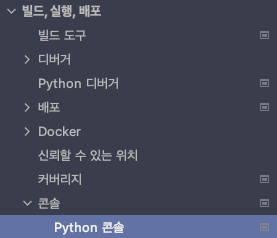
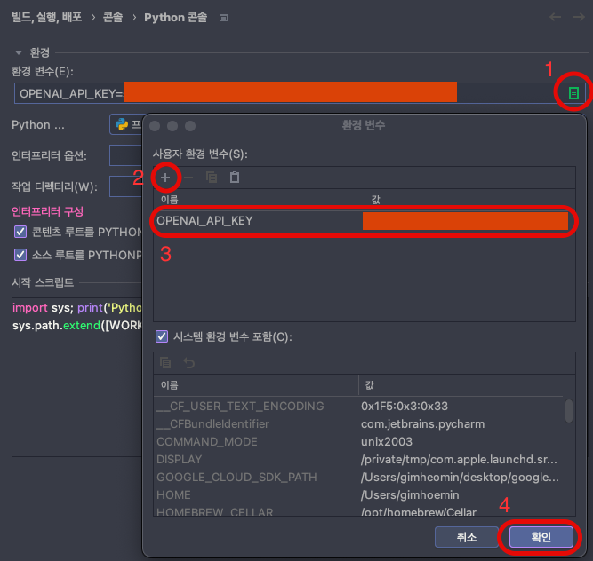

# 공용으로 사용되는 기능들 모음

## load_env.py - EnvLoader

OS 의 환경 설정 (`env`) 을 불러오는 기능을 수행합니다.

### import

```python
from common import EnvLoader

EnvLoader.load()
```

### 해당 기능을 사용하기 위해선 환경 설정을 등록해야 합니다.

#### 등록 방법 1 ( 권장 )

OS 환경 설정에 OPENAI_API_KEY 를 등록합니다.

* terminal:
    * linux : `vim ~/.bashrc`
    * mac : `vim ~/.bash_profile`
* file: `export OPENAI_API_KEY="Key-String"`
* terminal: `source ~/.bashrc`

#### 등록 방법 2 ( PyCharm )



Setting > Build, Execution, Deployment > Console > Python Console



#### 등록 방법 3 ( DotEnv )

프로젝트 Root 폴더에 .env 파일을 생성하여 OPENAI_API_KEY 를 입력합니다.<br>
이 방법은 `dotenv` 라이브러리를 설치해야합니다.

* terminal: `pip install dotenv`
* terminal: `vim {project_root}/.env`
* file: `OPENAI_API_KEY="Key-String"`
